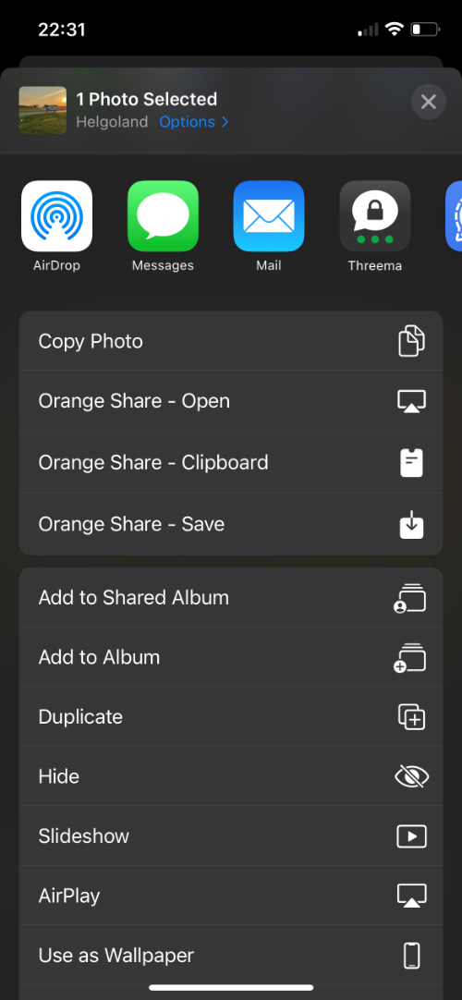
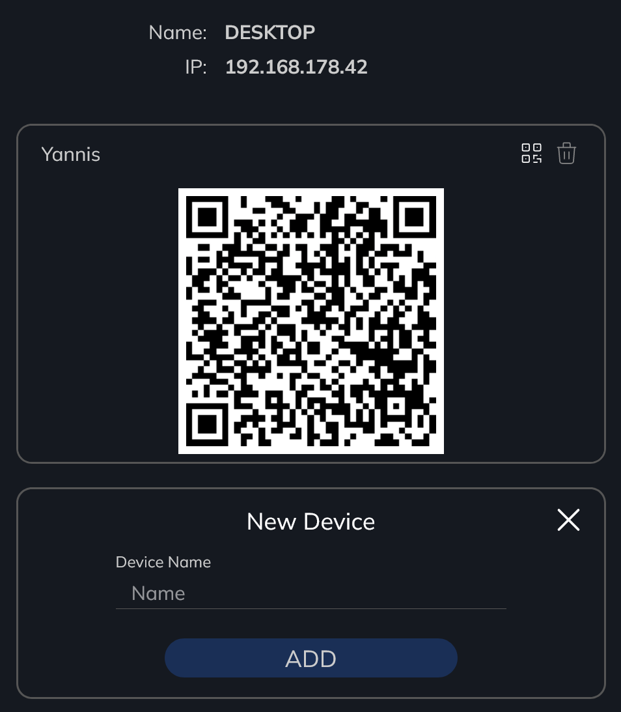
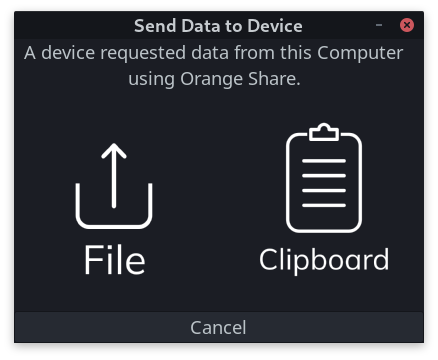

# Orange Share
A small python server that accepts requests from an Apple shortcut to allow sharing all sorts of media from iOS with any desktop OS.
It allows sending content right from the share sheet - similar to AirDrop between Apple Devices

## How it works
Orange Share consists of a webserver that should be able to run on any computer operating system and a few Shortcuts
that allow the user to open, save and copy content from an iPhone or iPad to a computer as well as request data from the computer.

The shortcuts will show up in the share sheet of files, links etc. and allow you to share whatever the content is with
the computer it is set up with.

By default, you can access the UI with settings for Orange Share on [localhost:7616](http://localhost:7616).
Here you can also find the shortcuts and establish connections to the devices.
The UI is only accessible from the host.

The API which is used by the mobile devices is opened on port 7615 by default.
It is accessible from devices in the network and secured with Basic Auth.
This means that only connected devices are able to send data to the computer.
Note that due to the http protocol, connection data will be sent over unencrypted connections.
Orange Share never sends out any data from the computer without a confirmation on the computer,
even if the correct credentials are set.

## Quick Start

### Installation

Choose one of the following methods of installation depending on the system you want to install on.

#### Windows

Go to the [releases](https://github.com/Yannis4444/Orange-Share/releases),
download the newest Orange Share executable (`orangeshare-x.x.x.exe`)
and run the installer.

This Version of Orange Share will show an icon in the system tray (lower right corner; may be hidden behind the up arrow).
The Tray Icon offers a right click menu to start, stop and exit Orange Share.

It also allows you to add Orange Share to Windows startup when installing.
If you enable this option Orange Share will start as inactive and can be activated from the tray.

#### GNOME Shell Extension

A GNOME Shell Extension is available [here](https://extensions.gnome.org/extension/4469/orange-share/).

When first enabling Orange Share by clicking the icon in the top bar, you will be prompted to install the python package.
I was not allowed to host the python part on the GNOME Shell Extension page which is why installing and updating will be taken care of using pip.

Once everything is installed, you can enable and disable Orange Share by clicking on an icon in the top bar.
Right-click will open a short menu with some options and double-clicking the icon will open the settings in your browser.

#### Using PIP

Orange Share can be installed by running `pip install orangeshare`.

After that, it can be run using the command `python -m orangeshare` or just `orangeshare` on Linux.

### Downloading the Shortcuts

To use Orange Share you will need a few Shortcuts.
These can be downloaded right from the user interface by scanning the QR codes with the camera app on your iPhone/iPad.

There are different Shortcuts with different functions.
Here I will only go over the basics you need to know to get started.
You can find a more in depth description in the user interface and [below](https://github.com/Yannis4444/Orange-Share#shortcuts.

If you run into problems with "untrusted shortcuts" take a look at [this](https://github.com/Yannis4444/Orange-Share#untrusted-shortcuts).
This is a security mechanism from Apple to make sure users do not just run any shortcut.

### Connecting a Device to the Computer

All the communication between the shortcuts and the computer use Basic Auth to avoid unauthorised requests.
Therefore, you need to create a new connection under Connected Devices in the settings.

There you can set the name of your computer which is only relevant for display purposes on the devices and the IP address of your computer.
The IP will be saved in combination with your WiFi name.
This means that you can set different IPs for different Networks.
If you are unsure which IP is the right one just go through them until one works.

To add a connection click ADD and then enter a name for the connection.
Click ADD again and scan the resulting QR code using the Connection Manager Shortcut (Scann QR Code).
This will establish and test the connection.

You can manage connected devices from this shortcut as well.
To connect to a computer you can also simply scan the QR code again.

If you wish to synchronise your connection between your devices you can set to do so using iCloud here too.

### Sharing Data

Once everything is set up, you can choose any content you wish to share on your iPhone/iPad (like a photo) and click share.
There you should find the different Orange Share options.

If you wish to have Orange Share always appear on top you can use `Edit Actions...` at the bottom of this list.

### Requesting Data from the Computer

There is also the `Get Data` Shortcut which allows you to request data from the computer.

You have now completed the basic steps to set up Orange Share and should be able to share content between you devices.
If you encounter any problems please let me know by creating an issue.

## Updating

Once a new version of Orange Share is available, you will be notified.
You can of cause ignore this if you wish to - I will not force you to update.

The Windows and GNOME Shell Extension versions can be updated right from the user interface.
Instructions on how to do so will be shown there as well.

The pip version can be updated just like any pip package by calling `pip install --upgrade orangeshare`.

## Shortcuts

Orange Share uses several [shortcuts](https://support.apple.com/guide/shortcuts/welcome/ios) for different parts of its functionality.
These shortcuts have to be installed on the device from which content shall be shared.

The shortcuts can be found in the UI of the application or below.

#### Untrusted Shortcuts

To import the needed shortcuts, you might need to enable `Allow Untrusted Shortcuts` in your devices settings.
This option can be found in `Settings > Shortcuts`.

If you have never before used Shortcuts, chances are, that `Allow Untrusted Shortcuts` is grayed out.
If this is the case, you have to run a shortcut first.
To do this, open the Shortcuts App and choose any of the available shortcuts or create one yourself.
Once you ran a shortcut, the option to enable untrusted shortcuts should become available.

#### How to use the Shortcuts

Once the shortcuts are installed, they are shown in the Shortcuts App.
Here you can start or edit them.
When you run a shortcut that sends data to the computer here, it will send the contents of your clipboard.

You can find most shortcuts in the share sheets of the device.
This means that whenever you click `share` on the device you can find these shortcuts in the list.
At the bottom of this list you can find an option to edit the shown entries.
Here you can add the Orange Share shortcuts to your favorites if you want them to always be at the top.

### Connection Manager

This shortcut is always needed to manage the connections to the host computer running Orange Share.
It has to be run directly from the Shortcuts App or added to the home screen and run from there.
It is also possible to add this as a back tap action for easier access.

The device is able to save multiple connections while only one can be active at a time.
In order to do so, some files will be created on your iCloud (`/Shortcuts/orangeshare/`).

[Download](https://www.icloud.com/shortcuts/c80782d8c8954b1f96de6784441fb9a6)

### Open

The open shortcut will open content in its respective application on the computer.

For URLs, it will open the website in the default browser, any other files will be opened in their default applications.
To make this work, files are saved in a temporary folder.

[Download](https://www.icloud.com/shortcuts/ebc4cd8ec7954ac68f723d79fdf30276)

### Save

The save shortcut will open a save-file-dialog on the computer with which shared content can be saved anywhere on the computer.

[Download](https://www.icloud.com/shortcuts/ca1d351c41e14806b40c21c995a8f4f0)

### Clipboard

The clipboard shortcut will copy any text to the clipboard of the computer.
Once copied, it can be pasted anywhere.

Copying files will be coming soon.

[Download](https://www.icloud.com/shortcuts/7f10334354f9479aaf156139383f3a73)

### Get Data

This shortcut can be used to get data from the computer.
It will open a window on the computer where either a file or the current clipboard content can be sent to the phone.

[Download](https://www.icloud.com/shortcuts/f1e9e2f318f447508ab956884936c614)

## Advanced Options

### Run Options

Argument | Description
---------|------------
-h, --help | print a help message
--version | print the current version
-p \<port\>, --api-port \<port\> | Port number of the api server (default: 7615)
-u \<port\>, --ui-port \<port\> | Port number of the UI server (default: 7616)
-o, --open-ui | Open the server controls in the browser on start
-t, --tray-icon | Run with tray icon (only available on windows, see [Gnome Shell Extension](#gnome-shell-extension) for Linux with Gnome)
-v, --verbose | enable Verbose output

### Linux Autostart

To run Orange Share at system startup you can copy the `orange-share.desktop` to the `~/.config/autostart` directory.

Autostart for windows and GNOME can be handled by the installer and the extension.

## Configuration

A configuration file can be found in the user's config directory.
On Linux for example this would be `~/.config/orangeshare/config.ini`.
The file location will also be shown in the web UI.

Once changed you will have to restart Orange Share.